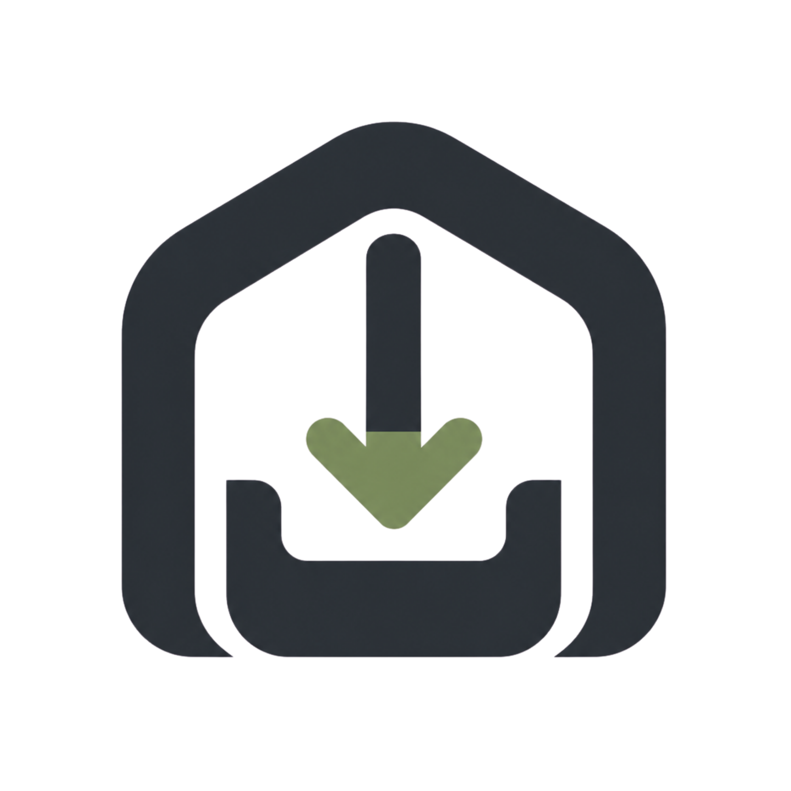

# Drop Den



Drop Den moves files and short messages between devices on the same local
network. There are no accounts, no cloud uploads, and no public sharing links.

Run Drop Den on one computer, then connect nearby phones, tablets, and other
computers through the displayed local address or QR code.

## What you can do

- Share several files at once with everyone or a specific device.
- Preview images, video, and audio before downloading.
- Download individual files or the available files as a ZIP.
- Send short messages between connected devices.
- Use the browser interface on Chrome, Firefox, and other modern browsers.
- Run Drop Den as a compact Linux desktop app.
- Receive files from the Android share sheet using the Android app.

Transfers remain on the host computer. They expire after 24 hours by default,
and the host can select a lifetime from 1 hour to 30 days. Drop Den is intended
for trusted home, office, and event networks—not direct exposure to the public
internet.

## Downloads

Public release downloads are being prepared. Releases will provide:

- a Linux RPM desktop package;
- an Android APK;
- a Windows NSIS installer;
- a server package for browser-based access;
- macOS packages in a later release.

Until the first public release is published, the current unsigned packages can
be built from source using the instructions below. Unsigned Windows installers
may trigger Microsoft Defender SmartScreen, and the Android debug APK is for
testing rather than store distribution.

## Getting started

1. Install and start Drop Den on the computer that will act as the host.
2. Open the local address displayed by the host on another device, or scan its
   QR code.
3. Give the device a name and enter the six-digit join PIN shown by the host.
4. Choose files, select a destination, and send.

All participating devices must be connected to the same local network and able
to reach the host computer.

## Supported experiences

| Experience | Status |
| --- | --- |
| Browser clients | Supported on modern Chrome and Firefox |
| Linux desktop host | Available; public package preparation is ongoing |
| Android client and share target | Implemented; signed release packaging pending |
| Windows desktop host | Unsigned NSIS installer available through GitHub Actions |
| macOS desktop host | DMG build foundation available; release packaging pending |

## Build packages from source

Clone the repository before using any of the build commands:

```bash
git clone https://github.com/ElijahMwambazi/drop-den.git
cd drop-den
```

### Linux RPM

Build on a supported Fedora Linux system with Node.js 22, Yarn 1.22.22, stable
Rust, and the native Tauri dependencies installed:

```bash
sudo dnf install \
  glib2-devel gobject-introspection-devel gtk3-devel \
  webkit2gtk4.1-devel libsoup3-devel javascriptcoregtk4.1-devel \
  openssl-devel curl wget file libappindicator-gtk3-devel librsvg2-devel

npm install --global yarn@1.22.22
./scripts/build-desktop.sh
```

The RPM is written to:

```text
src-tauri/target/release/bundle/rpm/
```

Review the [RPM release checklist](docs/RPM_RELEASE_CHECKLIST.md) before
installing or distributing the package.

### Android APK

Install Android Studio with Android SDK 36.1, Build Tools 36.1.0, and a complete
JDK 17 or newer that includes `javac`. Set the local SDK path in the ignored
`android-wrapper/local.properties` file:

```properties
sdk.dir=/home/you/Android/Sdk
```

Build the current debug APK:

```bash
cd android-wrapper
./gradlew :app:assembleDebug
```

The APK is written to:

```text
android-wrapper/app/build/outputs/apk/debug/app-debug.apk
```

See the [Android wrapper guide](android-wrapper/README.md) for the Flatpak
Android Studio JDK setup and device test flow.

### Windows NSIS installer

The recommended build path is the manual **Windows desktop package** GitHub
Actions workflow. Open the repository's **Actions** tab, choose that workflow,
select **Run workflow**, and download the `drop-den-windows-x64` artifact after
the job succeeds.

To build locally, use 64-bit Windows with Node.js 22, Yarn 1.22.22, stable Rust
using `x86_64-pc-windows-msvc`, and Microsoft C++ Build Tools. From PowerShell
at the repository root, run:

```powershell
npm install --global yarn@1.22.22
.\scripts\build-desktop-windows.ps1
```

The installer is written to:

```text
src-tauri/target/release/bundle/nsis/*-setup.exe
```

Review the [Windows release checklist](docs/WINDOWS_RELEASE_CHECKLIST.md) before
distribution.

## Privacy and safety

- Files pass through the host computer, not a cloud service.
- Joining devices require a PIN after the host is created.
- Private operations require a revocable device session token issued at pairing.
- Transfers and messages are automatically cleaned up after their retention
  period.
- Anyone controlling the host computer can access its locally stored data.

Use Drop Den only on a network and host computer you trust.

Security migration note: upgrading an older installation to the trusted-beta
authentication model invalidates legacy device identities and clears protected
legacy content. Devices must pair again. See the
[security model](docs/SECURITY.md) before upgrading an installation with data
you need to retain.

## Learn more

- [Project and technical overview](docs/dropden.md)
- [Known issues and fixes](docs/ISSUES.md)
- [Roadmap](docs/ROADMAP.md)
- [Security model](docs/SECURITY.md)
- [API reference](docs/API.md)
